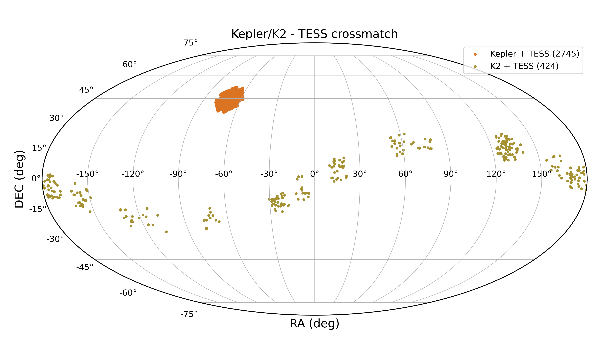

# Exoplanetas: crossmatch entre Kepler/K2 - TESS
Crossmatch entre os exoplanetas que foram detectados pelo Kepler/K2 e estão no catálogo do TESS.

## Resumo
O alvorecer das missões espaciais especialmente dedicadas a detectar exoplanetas, que começou com a missão __[CoRoT](https://www.esa.int/Science_Exploration/Space_Science/COROT_overview)__ (lançada em 2007) e teve seu ápice (até o momento) com as missões __[Kepler](https://science.nasa.gov/mission/kepler/)__ (e sua continuação __[K2](https://science.nasa.gov/mission/kepler/)__) e __[TESS](https://tess.mit.edu/)__, contribuiu, sem precedentes, com o nosso conhecimento acerca das populações planetárias. Atualmente, mais de 5700 exoplanetas (dado coletado em 17/11/2024) foram detectados (segundo o __[NASA Exoplanet Archive](https://exoplanetarchive.ipac.caltech.edu/index.html)__), sendo 4300 deles detectados via trânsito planetário. 

As missões Kepler/K2 e TESS, em conjunto, são os instrumentos responsáveis pela detecção de, aproximadamente, 3900 exoplanetas (dado de 17/11/2024):

- ```Kepler```: 2778 exoplanetas
- ```K2```: 548 exoplanetas
- ```TESS```: 570 exoplanetas

Nosso objetivo com este projeto é montar tabelas contendo as estrelas que possuem exoplanetas detectados pelo Kepler ou K2 e que foram observadas pela missão TESS.  

## Sobre os arquivos

Este repositório contém 4 arquivos contendo os códigos relacionados diretamente ao projeto (```2 notebooks``` e ```2 arquivos .py```). O conteúdo de cada arquivo é o seguinte:

- Notebooks:

  - ```download_dados.ipynb```: Mostra (passo a passo) como foi feita a seleção dos dados dos exoplanetas disponíveis na base de dados do NASA Exoplanet Archive que foram detectados pelas missões K2, Kepler e TESS. Basicamente, é uma versão passo a passo do arquivo ```KeplerK2TessQuery.py```;
  - ```crossmatch_tess.ipynb```: Mostra como foi feito o crossmatch entre os dados do Kepler e K2 com o TESS para identificar quais estrelas dos dois primeiros catálogos que possuem exoplanetas detectados, tem observações feitas pelo TESS.
 
- Arquivos ```.py```:

  - ```KeplerK2TessQuery.py```: Mostra como foi feita a automatização da seleção dos dados dos exoplanetas disponíveis na base de dados do NASA Exoplanet Archive que foram detectados pelas missões K2, Kepler e TESS. É uma versão automatizada do notebook ```download_dados.ipynb```;
  - ```tess_sectors.py```: Mostra como foi feita a busca por quais setores do TESS as estrelas hospedeiras (que estão nesta base de dados) foram observadas e quais deles possuem curvas de luz.
 

 
## Autores
- __[João Aires (UFRN)](http://lattes.cnpq.br/2805900511454723)__
- __[Leonardo Andrade de Almeida (ECT/UFRN)](http://lattes.cnpq.br/7812463045514059)__

## GitHub
- __[jvflaires](https://github.com/jvflaires)__
- __[titanufrn](https://github.com/titanufrn)__

